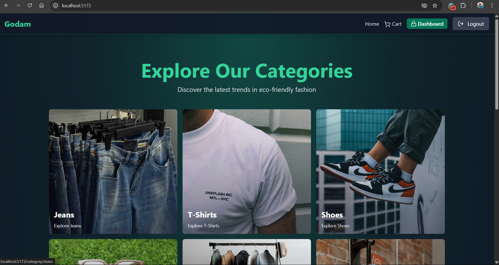
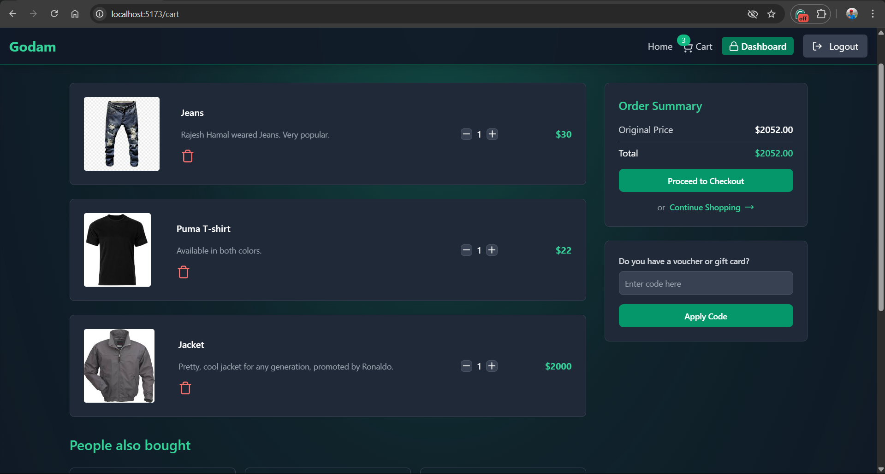
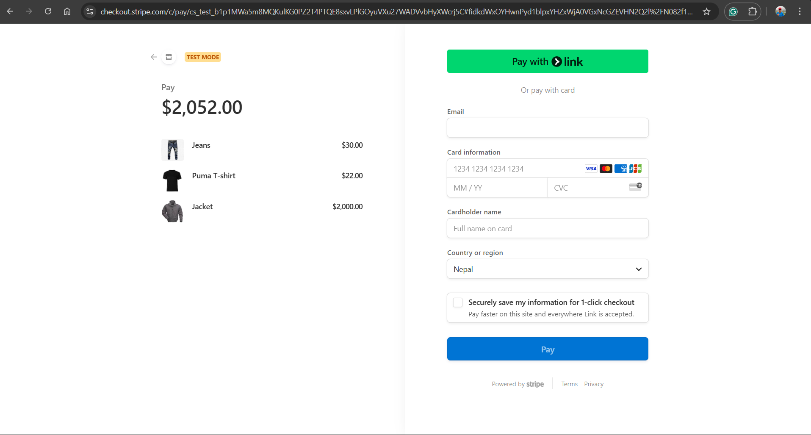

# E-Commerce MERN Project

## Overview
This is a full-stack **E-Commerce** application built using the **MERN** stack (MongoDB, Express.js, React, and Node.js). The project includes features like user authentication, product management, cart functionality, order processing, and Stripe-based payments.

## Features
### 🔹 Authentication & Authorization
- User registration & login (JWT-based authentication)
- Role-based access (Admin & User)

### 🔹 Product Management
- View all products with filtering & sorting
- Add, update, and delete products (Admin only)

### 🔹 Shopping Cart & Checkout
- Add & remove products from the cart
- Apply discount coupons
- Process payments with **Stripe**

### 🔹 Order Management
- Place orders & view order history
- Admin dashboard for order tracking

## Technologies Used
- **Frontend:** React, Redux, Tailwind CSS
- **Backend:** Node.js, Express.js
- **Database:** MongoDB with Mongoose
- **Authentication:** JWT (JSON Web Token)
- **Payments:** Stripe API
- **State Management:** Zustand

## Installation & Setup
### 1️⃣ Clone the Repository
```bash
git clone https://github.com/KarunJr/Ecommerce_MERN.git
cd ecommerce-mern
```

### 2️⃣ Install Dependencies
#### Backend
```bash
cd backend
npm install
```
#### Frontend
```bash
cd ../frontend
npm install
```

### 3️⃣ Setup Environment Variables
Create a **.env** file in the `backend` directory and add:
```env
PORT=5000
MONGO_URI=your_mongodb_connection_string
JWT_SECRET=your_jwt_secret
STRIPE_SECRET_KEY=your_stripe_secret_key
```

### 4️⃣ Run the Project
#### Start Backend Server
```bash
cd backend
npm run dev
```
#### Start Frontend
```bash
cd frontend
npm start
```

## API Endpoints
### 🔹 User Routes
| Method | Endpoint          | Description           |
|--------|------------------|----------------------|
| POST   | `/api/auth/register` | Register a new user |
| POST   | `/api/auth/login` | Login user |

### 🔹 Product Routes
| Method | Endpoint        | Description             |
|--------|----------------|-------------------------|
| GET    | `/api/products` | Get all products |
| POST   | `/api/products` | Add a new product (Admin) |

### 🔹 Cart Routes
| Method | Endpoint       | Description                 |
|--------|---------------|-----------------------------|
| POST   | `/api/cart`   | Add product to cart |
| DELETE | `/api/cart`   | Remove product from cart |

## Deployment
### **Backend Deployment**
- Deploy using **Render** or **Vercel**
- Set up MongoDB Atlas for cloud database

### **Frontend Deployment**
- Deploy React frontend on **Vercel** or **Netlify**

## Screenshots







## Contact
For any issues, feel free to reach out!
- **GitHub:** https://github.com/KarunJr
- **Email:** ghimirekarun406@gmail.com

---
**🚀 Thank you for checking out this project!**

